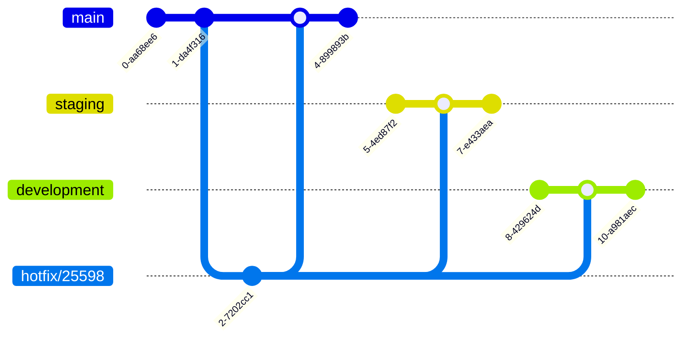
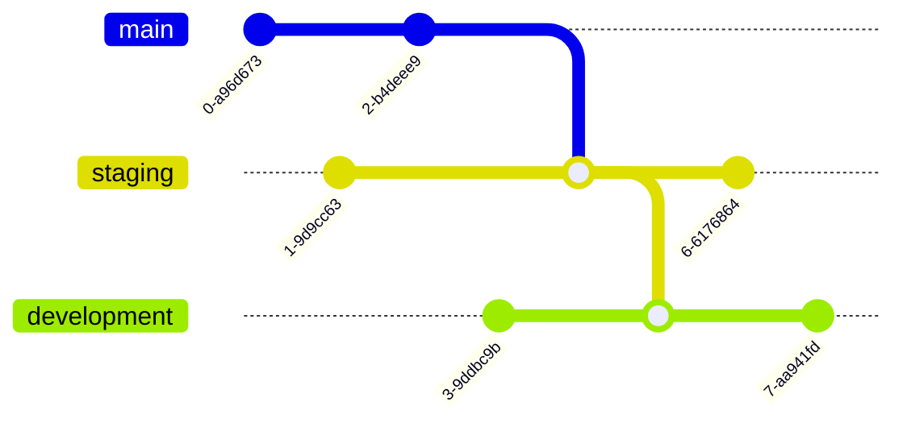

# Branching strategy

## Table of Contents
1. [Overview](#overview)
2. [Process](#process)
3. [Example](#example)
4. [Hot-fix](#hot-fix)
5. [Housekeeping](#housekeeping)

## Overview
The branching strategy resembles the [GitLab flow](https://about.gitlab.com/topics/version-control/what-is-gitlab-flow/#how-does-git-lab-flow-work), but it has some differences. This document describes the differences and why they exist.

There are three long living branches that represent the three deployment environments
- main (master) - production ready code
- staging - changes ready for final testing and demonstration to users
- development - changes ready for internal integration testing (e.g. between API and UI)

> __*Note*__ When a PR is merged into any of these branches, the build (CI) and release (CD) pipelines kick off automatically.

## Process
Changes typically flow down from development -> staging -> master. The only exception is hot-fixes that go to master directly and then get merged back to the other two environments.
New branches are made from *master* and named __name/ticket#-optional-description__ (e.g. *someone/23418* or *someone/23418-add-a-thing*).

When the changes are ready to go into *development*
1. a new branch *someone/23418-to-dev* is created from *someone/23418* 
2. the *development* branch is merged into *someone/23418-to-dev* and
3. a PR from *someone/23418-to-dev* to *development* is created.

>__*Note*__ To ensure that *someone/23418* can independently move to staging and master, development __MUST NOT__ be merged into *someone/23418*, only into *someone/23418*__*-to-dev*__.

### Feature lifecycle

## Example
Developer Bob starts with ticket 24631.

Bob creates his feature branch *bob/24631* from *main* at commit point B and continues with his work. Assume that development and main are in sync at this point. Whilst he is developing commits C, D and E go into development. At commit H, he is ready to release his changes to *development*. The current state of commits in each branch is as follows:

|Branch|Commits|
|---|---|
|main|AB|
|development|AB CDE|
|bob/24631|AB FGH|

Bob creates a new merge branch *bob/24631-to-dev* from *bob/24631* and merges *development* into it.

Now, Bob has all his changes and all new changes in *development* in his merge branch. When he creates a PR from *bob/24631-to-dev* to *development*, only his changes F, G and H appear in the PR.

|Branch|Commits|
|---|---|
|main|AB|
|development|ABCDE|
|bob/24631|ABFGH|
|bob/24631-to-dev|ABFGCDEH|

Bob can now complete the PR and merge *bob/24631-to-dev* into *development*.

Now, after the merge, *development* contains Bob's changes and *bob/24631-to-dev* can safely be deleted when the PR completes.

|Branch|Commits|
|---|---|
|main|AB|
|development|ABFGCDEH|
|bob/24631|ABFGH|
|~~bob/24631-to-dev~~|~~ABFGCDEH~~|

> __*Note*__ The feature branch *bob/24631* still only contains Bob's changes for ticket 24631, and can move to staging and master independently from other work items.

## Hot-fix
Bob discovers a bug in his previous feature that was deployed to *main*. He creates a *hotfix/25598* branch with a fix and merges that back into *main*.

To ensure the other environments also gets this fix, he also pulls the change into *staging* and *development*.

## Housekeeping
Regular housekeeping should be performed where *main* is pulled down to *staging* and *development* to reduce the possibility of merge issues when new branches are created from *main*

